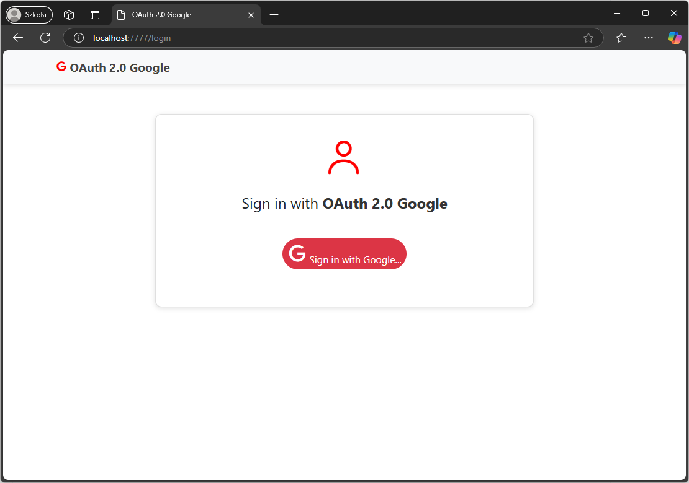
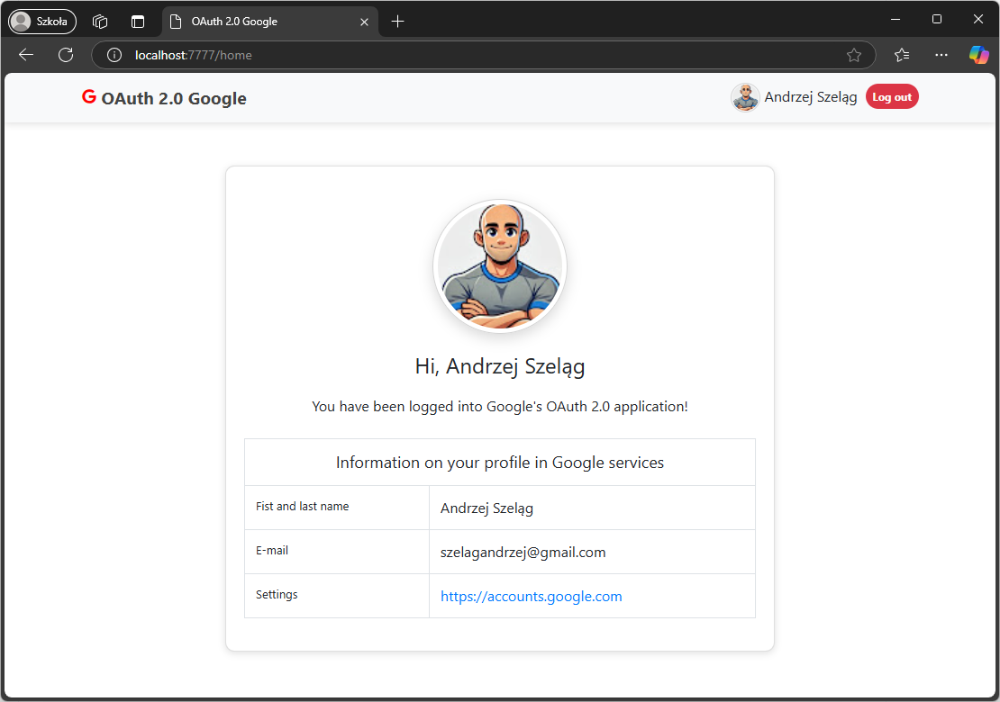

# OAuth 2.0 Google

### A Spring Boot web-based application configured to use OAuth 2.0 with Google API.

#### What is OAuth 2.0?

OAuth (Open Authorization) 2.0 is an open authorization standard. It provides a way for users to log into a web-based
application (Spring Security OAuth 2.0) by delegating the authentication process to trusted third-party services, such
as Google and GitHub. The full specification of the OAuth 2.0 protocol can be found
in [RFC 6749](https://datatracker.ietf.org/doc/html/rfc6749).

#### How use OAuth2.0?

1. Configuring an **OAuth 2.0 Google** application in **Google Cloud Platform** (https://cloud.google.com/).

   You need:

         CLIENT_ID
         CLIENT_SECRET  
         REDIRECT_URI

2. Clone a GitHub Repository to your computer:

          git clone https://github.com/AndrzejSzelag/oauth2google.git

3. Run JAR file and in your web browser paste a URL:

          https://localhost:7777
